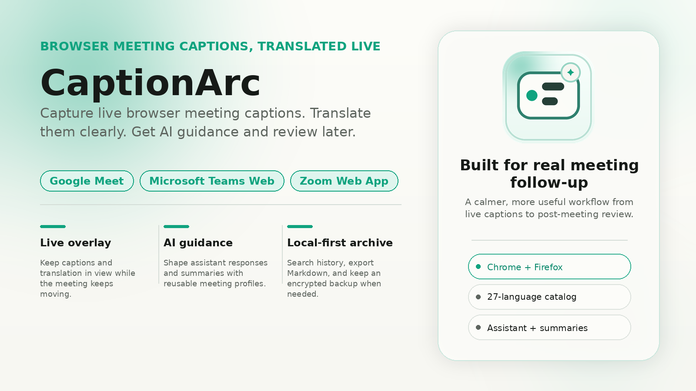

# CaptionArc

Turn browser meeting captions into live translation, AI guidance, searchable history, and usable follow-up.


CaptionArc is a browser extension for people who rely on live captions during web meetings and want more than a fleeting transcript. It captures visible captions from supported meeting pages, translates them with your OpenAI setup, can surface live AI guidance during the meeting, saves a local-first archive, and helps you come back later with search, exports, summaries, reusable meeting profiles, and optional personal cloud continuity.

> Capture what is visible now. Translate it in context. Review it later with a record you can actually use.

**Quick links**

- [Get the latest release artifacts](https://github.com/mahdiahmadi1991/caption-arc/releases)
- [Build from source](#quick-start)
- [Privacy Policy](./docs/security/privacy-policy.md)
- [Terms of Service](./docs/security/terms-of-service.md)
- [Read privacy notes](./docs/security/privacy-disclosure-notes.md)

**Supported meeting surfaces**

- Google Meet
- Microsoft Teams Web
- Zoom Web App

---

## Why CaptionArc

Browser meeting captions are useful in the moment, but they usually disappear when the call ends. That makes follow-up harder, especially in multilingual conversations, accessibility-heavy workflows, interviews, research sessions, and meetings where exact phrasing matters.

CaptionArc is built to close that gap:

- stay with the conversation through a live overlay instead of juggling multiple tools
- translate what is happening now with your own OpenAI configuration
- get live AI assistant guidance when a recurring meeting type needs faster answers, clearer next points, or risk callouts
- return later to searchable meeting history, Markdown exports, and reusable summary flows
- keep a local-first archive without giving up optional continuity across devices

---

## What you can do with it

- Capture visible live captions from supported browser meeting pages.
- Show translations in a floating in-meeting overlay.
- Use meeting profiles to tune live assistant guidance and summary behavior for recurring meeting types.
- Get live AI assistant guidance from meeting captions and supported chat context.
- Save sessions into a searchable archive for later review.
- Star, filter, export, and summarize what happened.
- Choose how capture starts with `off`, `ask`, or `always`.
- Mirror archive data to your own cloud app-data storage when continuity matters.

---

## Why teams and individuals use it

- Multilingual calls where participants need live translation support.
- Interviews and research sessions that need reliable post-meeting follow-up.
- Internal syncs where decisions should be easy to search, export, and summarize later.
- Local-first workflows where a browser extension is preferable to a separate meeting-notes platform.

---

## Core product story

### Live caption capture

CaptionArc works on Google Meet, Microsoft Teams Web, and Zoom Web App. It captures the captions the browser page exposes, which keeps the workflow grounded in the meeting surfaces you already use.

### Real-time translation

Translation runs through user-configured OpenAI credentials. The current language catalog supports 27 target and summary languages, including English, Persian, Japanese, Spanish, French, Arabic, Hindi, Turkish, and more.

### Live AI assistant

CaptionArc can generate live in-meeting guidance from recent captions and supported chat triggers. Meeting profiles let you tune the assistant for response intent, format, depth, tone, delivery bias, and participant scope, so the same product can fit multilingual calls, interviews, research sessions, and operational reviews without pretending every meeting needs the same kind of help.

### Searchable follow-up

Saved sessions can be searched, filtered by provider, sorted, starred, opened in detail later, and exported as Markdown transcripts. Summaries can be generated with reusable profiles designed for recurring meeting patterns, and saved assistant outputs stay attached to session detail for later review.

### Local-first continuity

The archive is local-first by design. If you want cross-device continuity, CaptionArc can mirror archive data to your own Google Drive App Data or OneDrive App Folder storage. It also supports encrypted `.mcbak` backup export and import with a passphrase.

### Caption and chat context

When supported provider chat capture is available and enabled, saved sessions can include both caption events and meeting chat events so history, exports, and summaries carry richer context.

---

## How it works

1. Join a supported browser meeting where captions are available on the page.
2. CaptionArc detects the meeting provider and follows your chosen startup behavior: `off`, `ask`, or `always`.
3. Live captions appear in the overlay, and translation can be applied using your configured OpenAI settings.
4. If your active meeting profile uses the assistant, CaptionArc can generate live guidance from salient caption or supported chat context.
5. Sessions are saved into a local archive for later search, export, assistant review, and summary generation.
6. If you enable continuity features, CaptionArc can mirror archive data to your own cloud app-data folder or create an encrypted backup file for recovery.

---

## Privacy and trust

CaptionArc is local-first, but it is not offline-only. The current repository supports these data boundaries:

- Settings, device-local secrets, runtime metadata, and archive data are stored locally in extension storage and IndexedDB.
- API keys are stored locally on the device.
- Caption and chat content are sent to OpenAI when translation, assistant, or summary features are used.
- Cloud sync is optional. When enabled, archive data is mirrored to user-owned Google Drive App Data or OneDrive App Folder storage.
- Capture is tied to supported browser meeting pages and startup behavior can require explicit approval before capture begins.

If you want implementation-aligned privacy details, start with [docs/security/privacy-disclosure-notes.md](./docs/security/privacy-disclosure-notes.md) and [docs/architecture/overview.md](./docs/architecture/overview.md).

Draft public-facing legal documents are available here:

- [Privacy Policy](./docs/security/privacy-policy.md)
- [Terms of Service](./docs/security/terms-of-service.md)

---

## Quick start

### Option 1: Build from source

Prerequisites:

- Node.js 20+
- `pnpm`
- Chrome or Firefox for unpacked extension loading

Install dependencies:

```bash
pnpm install
```

Build for Chrome:

```bash
pnpm build:chrome:production
```

Then load the unpacked extension from `.release/chrome/production` in `chrome://extensions`.

Build for Firefox:

```bash
pnpm build:firefox:production
```

Then load the unpacked extension from `.release/firefox/production` in `about:debugging#/runtime/this-firefox`.

To iterate locally during development:

```bash
pnpm dev
```

### Option 2: Use release artifacts

Tagged releases package Chrome and Firefox production builds as downloadable artifacts.

- [GitHub Releases](https://github.com/mahdiahmadi1991/caption-arc/releases)

### First-run setup

> Open the extension settings before your first live session if you want translation, assistant guidance, or summaries ready immediately.

To use live translation, assistant guidance, and summaries, configure:

- your OpenAI API key
- your preferred model
- target language and summary language
- optional meeting profiles
- optional cloud sync providers

Environment and local configuration details live in [docs/setup/environment-and-config.md](./docs/setup/environment-and-config.md).

---

## Compatibility and support

### Supported meeting platforms

- Google Meet (web)
- Microsoft Teams Web
- Zoom Web App

Desktop-native meeting clients are out of scope.

### Browser support

| Capability | Chrome | Firefox | Notes |
| --- | --- | --- | --- |
| Caption capture, translation, summaries, history, and settings | Yes | Yes | Governed browser builds exist for both targets. |
| Google Drive App Data sync | Yes | No | Intentionally gated on Firefox until browser identity support is verified. |
| OneDrive App Folder sync | Yes | No | Intentionally gated on Firefox until browser identity support is verified. |

For repository-level compatibility details, see [docs/quality/compatibility-matrix.md](./docs/quality/compatibility-matrix.md).

---

## FAQ

- **Which meeting platforms are supported?** Google Meet (web), Microsoft Teams Web, and Zoom Web App.
- **Does CaptionArc support native desktop meeting apps?** No. The current product boundary is browser-only.
- **Does CaptionArc include an AI assistant?** Yes. The live assistant can use recent caption context and supported chat triggers to generate guidance during meetings, and its behavior can be tuned per meeting profile.
- **Do I need an OpenAI API key?** Yes for translation, assistant, and summary features.
- **Does all meeting data stay on my device?** No. The archive is local-first, but OpenAI-backed features and optional cloud sync send data outside the device.
- **Is cloud sync available on Firefox?** Not yet. Google Drive and OneDrive sync remain intentionally gated on Firefox until browser identity support is verified.
- **Are browser-store install links available in this repository yet?** Not in the root README today. Use GitHub release artifacts or build from source.

---

## Developer section

### Local development

```bash
pnpm install
pnpm dev
pnpm build
pnpm zip
```

Useful commands:

```bash
pnpm build:chrome:development
pnpm build:firefox:development
pnpm test
pnpm test:google
pnpm test:google:coverage
pnpm test:targeted:plan
pnpm docs:check
```

### Project structure

- `entrypoints/content/`: provider detection, caption capture, overlay runtime, and in-meeting behavior
- `entrypoints/background/`: persistence, translation orchestration, summary jobs, history, and cloud sync
- `entrypoints/popup/`: quick status and entry actions
- `entrypoints/options/`: settings, recovery, diagnostics, and cloud sync controls
- `entrypoints/meeting-history/`: searchable archive and session review
- `docs/`: canonical project documentation

### Build outputs

Browser-specific artifacts are produced under `.release/`:

- `.release/chrome/development`
- `.release/chrome/production`
- `.release/firefox/development`
- `.release/firefox/production`

If you are evaluating runtime behavior, architecture, or setup details, start with [docs/README.md](./docs/README.md), [docs/architecture/overview.md](./docs/architecture/overview.md), and [docs/setup/local-development.md](./docs/setup/local-development.md).

---

## Roadmap

The public roadmap is intentionally lightweight for now.

- [docs/product/roadmap.md](./docs/product/roadmap.md)

---

## Contribution and license

Contributions should follow the repository guidance in [docs/contributing/README.md](./docs/contributing/README.md) and [AGENTS.md](./AGENTS.md).

CaptionArc is released under the GNU Affero General Public License, version 3 or later. See [LICENSE](./LICENSE).
